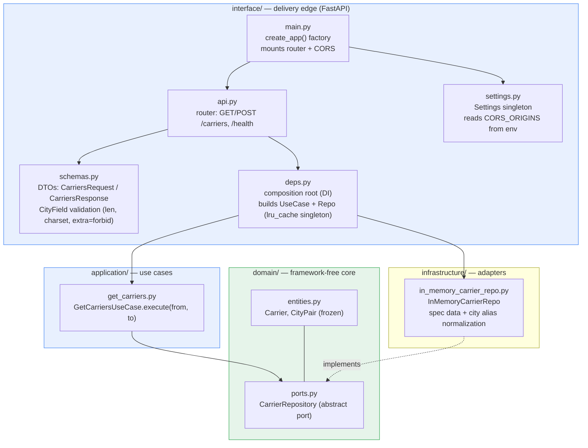
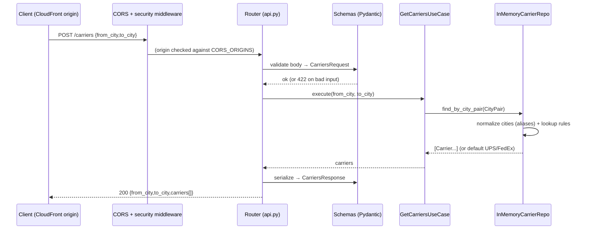

# Backend — structure & schemas (for explaining the code)

FastAPI service in **Clean Architecture**: dependencies point **inward**
(interface → application → domain ← infrastructure). The domain knows nothing
about FastAPI; the framework lives only at the edge. (See also the request
sequence in `specs/flow-diagram.md`.)

## Module map (what each file does)

## Request flow (POST /carriers)

## Why this shape (talking points)

- **Testability / mocking seam:** the use case depends on the **port**
  `CarrierRepository`, not on the concrete repo. Unit tests inject a mock; the
  router test uses FastAPI `dependency_overrides`. No real I/O in tests.
- **Single source of truth for data:** the spec's city-pair → carriers mapping
  lives only in `InMemoryCarrierRepo`. Swapping it for a real DB (the
  `carrier_corridor_volume` read model) needs **no change to the API contract**.
- **Validation & security at the edge:** `schemas.py` enforces input shape
  (length, allowed chars, `extra="forbid"`); `settings.py` drives CORS from
  `CORS_ORIGINS` (no `*`), so the deployed frontend origin is explicit.
- **Patterns used:** Repository (port), Factory + Singleton (`create_app`,
  `lru_cache` in `deps.py`), Dependency Injection (composition root in `deps.py`).
