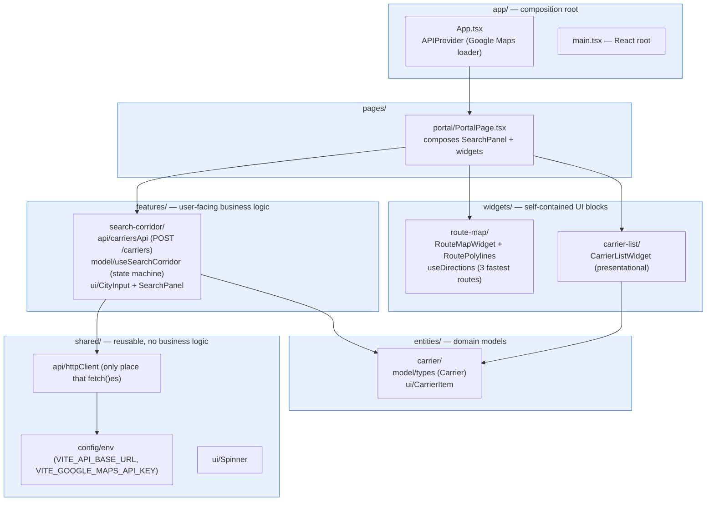
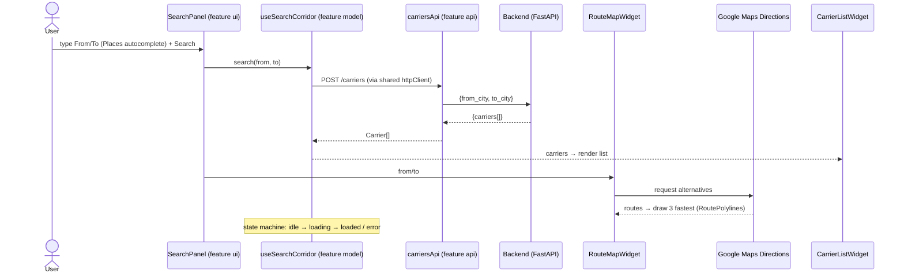

# Frontend — structure & schemas (for explaining the code)

React + TypeScript SPA organized with **Feature-Sliced Design (FSD)**. Imports
flow **one way, downward only**:

`app → pages → widgets → features → entities → shared`

A layer may only import from layers below it. This keeps business logic isolated
and the UI composable.

## Layer / module map (what each slice does)

## Runtime data flow (a search)

## Why this shape (talking points)

- **Separation of concerns:** business logic (the search state machine) lives in
  `features/search-corridor/model`, UI is dumb/presentational, and the **only**
  place that performs `fetch` is `shared/api/httpClient`.
- **Testability:** `useSearchCorridor` takes the api via dependency injection, so
  unit tests pass a mock api; `CarrierListWidget` is purely presentational; tests
  use mocks only — no real network or Google Maps calls.
- **Config isolation:** environment access is centralized in `shared/config/env`;
  Vite inlines `VITE_*` vars at build time (that's how the deployed bundle knows
  the App Runner backend URL and the Maps key).
- **Widgets are swappable:** `route-map` and `carrier-list` are independent blocks
  the page composes; neither knows about the other.
