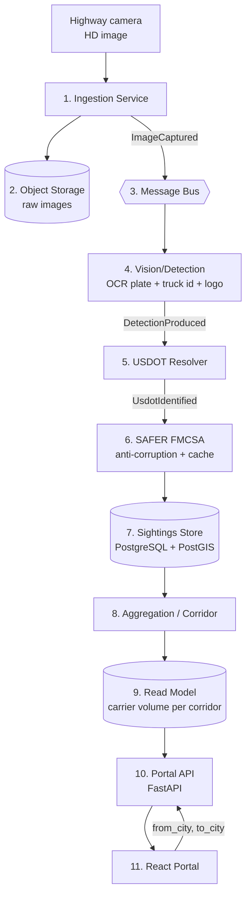
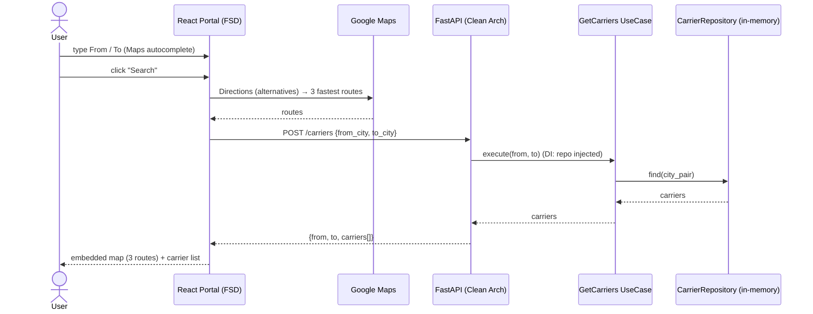
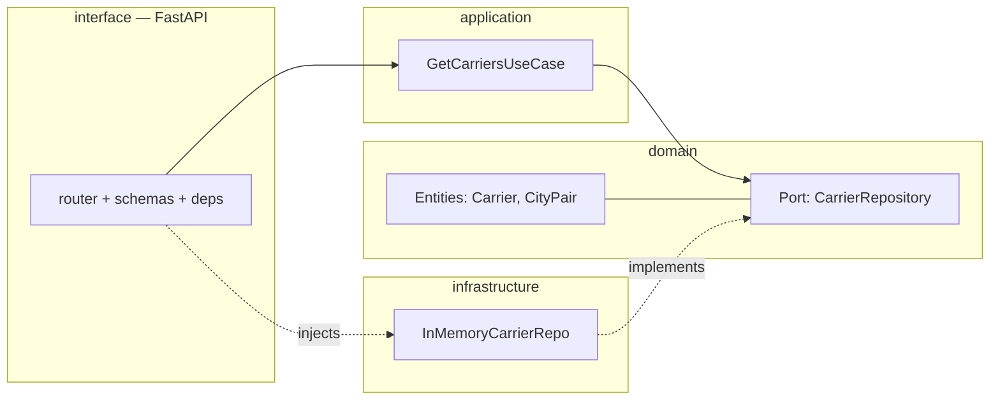

# Flow Diagrams (review these first)

> Added to `specs/` as agreed: see the flow before implementing, so it's clear
> what to review. Rendered with Mermaid (GitHub renders these natively).

## A. Platform data flow (point 2 — the full Genlogs platform)

## B. Simulation request flow (point 4 — what we are building now)

## C. Backend Clean Architecture layers (dependencies point inward)

> Mocking seam for unit tests: the use case depends on the **port** `CarrierRepository`.
> Tests inject a **mock repo**; the router test uses FastAPI `dependency_overrides`.
